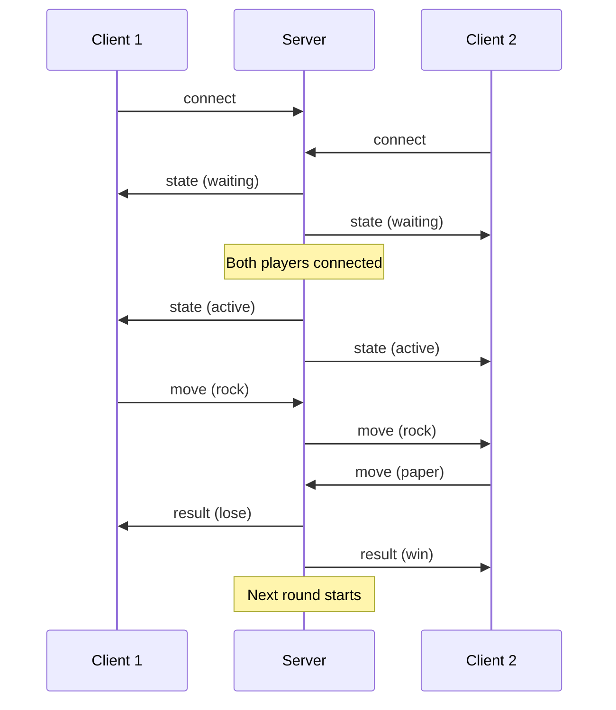
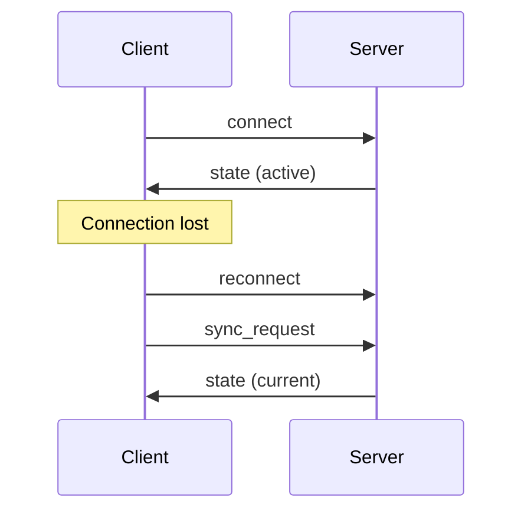

# WebSocket Protocol Documentation

This document describes the WebSocket protocol used for real-time communication between the React frontend and Django backend in the Rock Paper Scissors game.

## Overview

The WebSocket protocol enables real-time bidirectional communication for multiplayer gameplay. All messages are JSON-encoded with a consistent structure containing a `type` field and optional `payload`.

## Connection

### WebSocket URL

```
ws://localhost:8000/ws/match/<match_id>/
```

### Connection Flow

1. **Client connects** to WebSocket endpoint
2. **Server accepts** connection and adds to match group
3. **Client authenticates** (optional, for user identification)
4. **Game state synchronization** begins

### Authentication

```json
{
  "type": "authenticate",
  "token": "jwt-token-here"
}
```

## Message Format

All WebSocket messages follow this structure:

```json
{
  "type": "message_type",
  "payload": {
    // Message-specific data
  },
  "timestamp": "2024-01-01T12:00:00Z"  // Optional, server-generated
}
```

## JSON Schemas

### Base Message Schema

```json
{
  "$schema": "http://json-schema.org/draft-07/schema#",
  "type": "object",
  "properties": {
    "type": {
      "type": "string",
      "description": "Message type identifier"
    },
    "payload": {
      "type": "object",
      "description": "Message-specific data"
    },
    "timestamp": {
      "type": "string",
      "format": "date-time",
      "description": "ISO 8601 timestamp"
    }
  },
  "required": ["type"],
  "additionalProperties": false
}
```

## Client → Server Messages

### 1. Move Message

**Type**: `move`

**Schema**:
```json
{
  "$schema": "http://json-schema.org/draft-07/schema#",
  "type": "object",
  "properties": {
    "type": {
      "type": "string",
      "enum": ["move"]
    },
    "payload": {
      "type": "object",
      "properties": {
        "choice": {
          "type": "string",
          "enum": ["rock", "paper", "scissors"],
          "description": "Player's move choice"
        }
      },
      "required": ["choice"],
      "additionalProperties": false
    }
  },
  "required": ["type", "payload"]
}
```

**Example**:
```json
{
  "type": "move",
  "payload": {
    "choice": "rock"
  }
}
```

### 2. Sync Request Message

**Type**: `sync_request`

**Schema**:
```json
{
  "$schema": "http://json-schema.org/draft-07/schema#",
  "type": "object",
  "properties": {
    "type": {
      "type": "string",
      "enum": ["sync_request"]
    },
    "payload": {
      "type": "object",
      "additionalProperties": false
    }
  },
  "required": ["type"]
}
```

**Example**:
```json
{
  "type": "sync_request"
}
```

### 3. Timeout Message

**Type**: `timeout`

**Schema**:
```json
{
  "$schema": "http://json-schema.org/draft-07/schema#",
  "type": "object",
  "properties": {
    "type": {
      "type": "string",
      "enum": ["timeout"]
    },
    "payload": {
      "type": "object",
      "properties": {
        "playerId": {
          "type": "integer",
          "minimum": 1,
          "description": "ID of the player who timed out"
        },
        "timestamp": {
          "type": "string",
          "format": "date-time",
          "description": "When timeout occurred"
        }
      },
      "required": ["playerId", "timestamp"],
      "additionalProperties": false
    }
  },
  "required": ["type", "payload"]
}
```

**Example**:
```json
{
  "type": "timeout",
  "payload": {
    "playerId": 1,
    "timestamp": "2024-01-01T12:00:00Z"
  }
}
```

## Server → Client Messages

### 1. Move Notification

**Type**: `move`

**Schema**:
```json
{
  "$schema": "http://json-schema.org/draft-07/schema#",
  "type": "object",
  "properties": {
    "type": {
      "type": "string",
      "enum": ["move"]
    },
    "payload": {
      "type": "object",
      "properties": {
        "move": {
          "type": "object",
          "properties": {
            "playerId": {
              "type": "integer",
              "minimum": 1,
              "description": "ID of the player who made the move"
            },
            "choice": {
              "type": "string",
              "enum": ["rock", "paper", "scissors"],
              "description": "Move choice"
            },
            "timestamp": {
              "type": "string",
              "format": "date-time",
              "description": "When the move was made"
            }
          },
          "required": ["playerId", "choice", "timestamp"],
          "additionalProperties": false
        }
      },
      "required": ["move"],
      "additionalProperties": false
    }
  },
  "required": ["type", "payload"]
}
```

**Example**:
```json
{
  "type": "move",
  "payload": {
    "move": {
      "playerId": 2,
      "choice": "paper",
      "timestamp": "2024-01-01T12:00:00Z"
    }
  }
}
```

### 2. Round Result

**Type**: `result`

**Schema**:
```json
{
  "$schema": "http://json-schema.org/draft-07/schema#",
  "type": "object",
  "properties": {
    "type": {
      "type": "string",
      "enum": ["result"]
    },
    "payload": {
      "type": "object",
      "properties": {
        "result": {
          "type": "object",
          "properties": {
            "winner": {
              "type": "integer",
              "minimum": 0,
              "description": "ID of winning player (0 for draw)"
            },
            "result": {
              "type": "string",
              "enum": ["win", "lose", "draw"],
              "description": "Result from perspective of current player"
            },
            "player1_id": {
              "type": "integer",
              "minimum": 1,
              "description": "ID of player 1"
            },
            "player2_id": {
              "type": "integer",
              "minimum": 1,
              "description": "ID of player 2"
            },
            "moves": {
              "type": "array",
              "items": {
                "type": "object",
                "properties": {
                  "playerId": {
                    "type": "integer",
                    "minimum": 1
                  },
                  "choice": {
                    "type": "string",
                    "enum": ["rock", "paper", "scissors"]
                  },
                  "timestamp": {
                    "type": "string",
                    "format": "date-time"
                  }
                },
                "required": ["playerId", "choice", "timestamp"],
                "additionalProperties": false
              },
              "minItems": 2,
              "maxItems": 2,
              "description": "Both players' moves"
            },
            "round_number": {
              "type": "integer",
              "minimum": 1,
              "description": "Current round number"
            }
          },
          "required": ["winner", "result", "player1_id", "player2_id", "moves", "round_number"],
          "additionalProperties": false
        }
      },
      "required": ["result"],
      "additionalProperties": false
    }
  },
  "required": ["type", "payload"]
}
```

**Example**:
```json
{
  "type": "result",
  "payload": {
    "result": {
      "winner": 2,
      "result": "lose",
      "player1_id": 1,
      "player2_id": 2,
      "moves": [
        {
          "playerId": 1,
          "choice": "rock",
          "timestamp": "2024-01-01T12:00:00Z"
        },
        {
          "playerId": 2,
          "choice": "paper",
          "timestamp": "2024-01-01T12:00:05Z"
        }
      ],
      "round_number": 1
    }
  }
}
```

### 3. Opponent Left

**Type**: `opponent_left`

**Schema**:
```json
{
  "$schema": "http://json-schema.org/draft-07/schema#",
  "type": "object",
  "properties": {
    "type": {
      "type": "string",
      "enum": ["opponent_left"]
    },
    "payload": {
      "type": "object",
      "additionalProperties": false
    }
  },
  "required": ["type"]
}
```

**Example**:
```json
{
  "type": "opponent_left"
}
```

### 4. Error Message

**Type**: `error`

**Schema**:
```json
{
  "$schema": "http://json-schema.org/draft-07/schema#",
  "type": "object",
  "properties": {
    "type": {
      "type": "string",
      "enum": ["error"]
    },
    "payload": {
      "type": "object",
      "properties": {
        "message": {
          "type": "string",
          "description": "Error description"
        },
        "code": {
          "type": "string",
          "description": "Error code for programmatic handling"
        },
        "details": {
          "type": "object",
          "description": "Additional error details"
        }
      },
      "required": ["message"],
      "additionalProperties": false
    }
  },
  "required": ["type", "payload"]
}
```

**Example**:
```json
{
  "type": "error",
  "payload": {
    "message": "Invalid move choice",
    "code": "INVALID_MOVE",
    "details": {
      "valid_choices": ["rock", "paper", "scissors"]
    }
  }
}
```

### 5. State Sync

**Type**: `state`

**Schema**:
```json
{
  "$schema": "http://json-schema.org/draft-07/schema#",
  "type": "object",
  "properties": {
    "type": {
      "type": "string",
      "enum": ["state"]
    },
    "payload": {
      "type": "object",
      "properties": {
        "status": {
          "type": "string",
          "enum": ["waiting", "active", "completed"],
          "description": "Match status"
        },
        "moves": {
          "type": "array",
          "items": {
            "type": "object",
            "properties": {
              "playerId": {
                "type": "integer",
                "minimum": 1
              },
              "choice": {
                "type": "string",
                "enum": ["rock", "paper", "scissors"]
              },
              "timestamp": {
                "type": "string",
                "format": "date-time"
              }
            },
            "required": ["playerId", "choice", "timestamp"],
            "additionalProperties": false
          },
          "description": "Current round moves"
        },
        "opponent": {
          "type": "object",
          "properties": {
            "id": {
              "type": "integer",
              "minimum": 1
            },
            "username": {
              "type": "string"
            }
          },
          "required": ["id", "username"],
          "additionalProperties": false
        },
        "timer": {
          "type": "object",
          "properties": {
            "countdown": {
              "type": "integer",
              "minimum": 0,
              "description": "Seconds remaining"
            },
            "isPlayerTurn": {
              "type": "boolean",
              "description": "Whether it's current player's turn"
            }
          },
          "required": ["countdown", "isPlayerTurn"],
          "additionalProperties": false
        },
        "current_round": {
          "type": "object",
          "properties": {
            "number": {
              "type": "integer",
              "minimum": 1
            },
            "player1_wins": {
              "type": "integer",
              "minimum": 0
            },
            "player2_wins": {
              "type": "integer",
              "minimum": 0
            }
          },
          "required": ["number", "player1_wins", "player2_wins"],
          "additionalProperties": false
        },
        "wins_needed": {
          "type": "integer",
          "minimum": 1,
          "description": "Wins needed to win the match"
        },
        "winner": {
          "type": ["integer", "null"],
          "minimum": 0,
          "description": "Match winner (0 for draw, null for ongoing)"
        }
      },
      "required": ["status", "wins_needed", "winner"],
      "additionalProperties": false
    }
  },
  "required": ["type", "payload"]
}
```

**Example**:
```json
{
  "type": "state",
  "payload": {
    "status": "active",
    "moves": [
      {
        "playerId": 1,
        "choice": "rock",
        "timestamp": "2024-01-01T12:00:00Z"
      }
    ],
    "opponent": {
      "id": 2,
      "username": "player2"
    },
    "timer": {
      "countdown": 25,
      "isPlayerTurn": false
    },
    "current_round": {
      "number": 1,
      "player1_wins": 0,
      "player2_wins": 0
    },
    "wins_needed": 3,
    "winner": null
  }
}
```

## Message Flow Examples

### Typical Game Flow



### Reconnection Flow



## Error Handling

### Error Codes

| Code | Description | Recovery |
|------|-------------|----------|
| `INVALID_MOVE` | Invalid move choice | Client validation |
| `NOT_YOUR_TURN` | Move out of turn | Wait for turn |
| `MATCH_FULL` | Match already full | Join different match |
| `MATCH_NOT_FOUND` | Match doesn't exist | Create new match |
| `INVALID_STATE` | Invalid game state | Request sync |
| `TIMEOUT_ERROR` | Timeout processing | Continue game |

### Error Recovery

1. **Client validation**: Validate moves before sending
2. **State sync**: Request full state sync on errors
3. **Reconnection**: Auto-reconnect with exponential backoff
4. **Graceful degradation**: Continue game with limited features

## Implementation Notes

### Client-Side

```javascript
// Message validation
const validateMessage = (message) => {
  const schema = getMessageSchema(message.type);
  return ajv.validate(schema, message);
};

// Message handling
const handleMessage = (message) => {
  if (!validateMessage(message)) {
    console.error('Invalid message format');
    return;
  }
  
  switch (message.type) {
    case 'move':
      handleMove(message.payload.move);
      break;
    case 'result':
      handleResult(message.payload.result);
      break;
    // ... other cases
  }
};
```

### Server-Side

```python
# Message validation
from jsonschema import validate, ValidationError

def validate_message(message, schema):
    try:
        validate(instance=message, schema=schema)
        return True
    except ValidationError:
        return False

# Message handling
async def receive(self, text_data):
    try:
        message = json.loads(text_data)
        message_type = message.get('type')
        
        if message_type == 'move':
            await self.handle_move(message.get('payload'))
        elif message_type == 'sync_request':
            await self.handle_sync_request()
        # ... other cases
    except json.JSONDecodeError:
        await self.send_error('Invalid JSON format')
```

## Testing

### Message Validation Tests

```javascript
// Test valid move message
const validMove = {
  type: 'move',
  payload: { choice: 'rock' }
};
expect(validateMessage(validMove)).toBe(true);

// Test invalid move message
const invalidMove = {
  type: 'move',
  payload: { choice: 'invalid' }
};
expect(validateMessage(invalidMove)).toBe(false);
```

### Integration Tests

```javascript
// Test move flow
const tester = new WebSocketIntegrationTester();
await tester.connectClients(1, 2);
await tester.sendMove(1, 'rock');
const moveMessage = await tester.waitForMessage(2, 'move');
expect(moveMessage.payload.move.choice).toBe('rock');
```

## Versioning

The protocol version is included in the WebSocket URL:

```
ws://localhost:8000/ws/v1/match/<match_id>/
```

Current version: **v1**

Backward compatibility is maintained within major versions. Breaking changes require a new version.

## Security Considerations

1. **Authentication**: JWT tokens for user identification
2. **Authorization**: Verify player belongs to match
3. **Rate limiting**: Prevent message flooding
4. **Input validation**: Strict schema validation
5. **CORS**: Proper origin validation

## Performance Considerations

1. **Message size**: Keep payloads minimal
2. **Batching**: Group multiple updates when possible
3. **Compression**: Enable WebSocket compression
4. **Connection pooling**: Reuse connections efficiently

---

This protocol documentation ensures consistent implementation across frontend and backend, enabling reliable real-time multiplayer gameplay.
